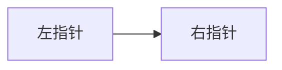

# 题目标题（例如：Two Sum）

## 基本信息

- 日期：YYYY-MM-DD
- 难度：Easy / Medium / Hard
- 题型：数组 / 哈希表 / 双指针 / 动态规划 / ...
- 题目链接：（可选）

## 题目描述

在这里写清楚题目要求。  
建议包含：
- 输入是什么
- 输出是什么
- 是否有唯一解
- 是否允许重复使用元素

## 输入输出示例

### 示例 1

- 输入：`...`
- 输出：`...`
- 解释：`...`

### 示例 2

- 输入：`...`
- 输出：`...`
- 解释：`...`

## 边界条件

- `...`
- `...`
- `...`

## 多解法

### 一般解法

- 核心思路：`...`
- 时间复杂度：`O(...)`
- 空间复杂度：`O(...)`

### 经典解法

- 核心思路：`...`
- 时间复杂度：`O(...)`
- 空间复杂度：`O(...)`

### 最优解法

- 核心思路：`...`
- 时间复杂度：`O(...)`
- 空间复杂度：`O(...)`

## 解题思路（以最优解法为主）

### 思路概述

用简洁语言描述核心方法（先说大方向，再说步骤）。

### 关键步骤

1. `...`
2. `...`
3. `...`

## 通俗白话讲解

把解法当成“给初学者解释”的版本：  
可以用生活类比，强调为什么这样做更快、更稳。

建议使用下面这种结构来写（更自然、易记）：

1. **先给类比场景**：比如舞会、排队、流水线、仓库管理等。
2. **再给规则映射**：把题目约束映射到类比规则（例如“先入场才能出场”）。
3. **最后落回算法动作**：说明代码里的每一步在类比中对应什么动作。

可直接套用句式：

- 你可以把这题想象成：`...`
- 规则是：`...`
- 所以代码里我们每一步其实在做：`...`

## 插图（可选）

需要示意图时，在本目录下创建 `images/`，放入图片后这样引用（相对路径）：

```markdown

```

也可用 Mermaid 画流程（无需图片文件），例如：



## 复杂度分析（对比）

- 一般解法：时间 `O(...)`，空间 `O(...)`
- 最优解法：时间 `O(...)`，空间 `O(...)`

## 代码实现

- Java：`SolutionLC<题号>.java`
- Python：`SolutionLC<题号>.py`
