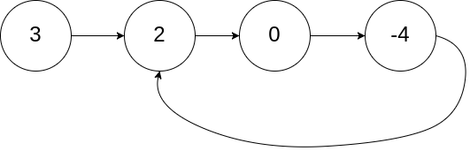

# LeetCode 141 - 环形链表

## 基本信息

- 日期：2026-04-08
- 难度：Easy
- 题型：链表
- 题目链接：[https://leetcode.com/problems/linked-list-cycle/](https://leetcode.com/problems/linked-list-cycle/)

## 题目描述

给你一个链表的头节点 `head`，判断链表中是否存在环。

如果链表中有某个节点，可以通过连续跟踪 `next` 指针再次到达，则链表中存在环。为了表示给定链表中的环，评测系统内部使用整数 `pos` 来表示链表尾连接到链表中的位置（索引从 `0` 开始）。注意：`pos` 不作为参数进行传递，仅用于标识链表的实际情况。

如果链表中存在环，返回 `true`；否则返回 `false`。

## 题目原图（来自 LeetCode）

- 本地图：`images/leetcode-image-01.png`
- 原图地址：`https://assets.leetcode.cn/aliyun-lc-upload/uploads/2018/12/07/circularlinkedlist.png`

- 本地图：`images/leetcode-image-02.png`
- 原图地址：`https://assets.leetcode.cn/aliyun-lc-upload/uploads/2018/12/07/circularlinkedlist_test2.png`

- 本地图：`images/leetcode-image-03.png`
- 原图地址：`https://assets.leetcode.cn/aliyun-lc-upload/uploads/2018/12/07/circularlinkedlist_test3.png`

## 输入输出示例

### 示例 1

- 输入：`head = [3,2,0,-4]`，`pos = 1`（尾结点连到索引为 `1` 的节点）
- 输出：`true`
- 解释：链表中存在环，其尾部连接到第二个节点。

### 示例 2

- 输入：`head = [1,2]`，`pos = 0`
- 输出：`true`
- 解释：链表中存在环，其尾部连接到第一个节点。

### 示例 3

- 输入：`head = [1]`，`pos = -1`
- 输出：`false`
- 解释：链表中没有环。

## 边界条件

- 链表可能为空（`head == null`），应返回 `false`
- 单节点且无自环时返回 `false`
- 环可能从任意节点开始，不限于头结点

## 多解法

### 一般解法

- 核心思路：遍历链表，用哈希集合记录已访问过的节点地址（或引用）；若某次 `next` 指向的节点已在集合中，说明有环。
- 时间复杂度：`O(n)`
- 空间复杂度：`O(n)`（集合最多存链表全部节点）

### 经典解法（最优）

- 核心思路：**快慢指针（Floyd 判环）**。慢指针每次走一步，快指针每次走两步；若有环，快指针会先进入环并在环内与慢指针相遇；若无环，快指针会先走到 `null`。
- 时间复杂度：`O(n)`
- 空间复杂度：`O(1)`（仅两个指针）

## 解题思路

### 思路概述

优先使用快慢指针：无环时链表有限，快指针会到头；有环时两人在环上必相遇。

### 关键步骤

1. 若 `head == null` 或 `head.next == null`，无环。
2. 初始化 `slow = head`、`fast = head`（或 `fast = head.next`，注意循环条件写法）。
3. 循环：`slow` 走一步，`fast` 走两步；若 `fast` 或 `fast.next` 为 `null` 则无环；若 `slow == fast` 则有环。

## 通俗白话讲解

把链表想成一条小路，有环就像路上绕圈回到走过的地方。  
快慢两人一起跑：直路尽头快的人会先跑出界（没环）；若是操场，快的人迟早会追上慢的人（有环）。

## 复杂度分析（对比）

- 哈希表：时间 `O(n)`，空间 `O(n)`
- 快慢指针：时间 `O(n)`，空间 `O(1)`（题解代码实现此版本）

## 代码实现

- Java：`SolutionLC141.java`
- Python：`SolutionLC141.py`

